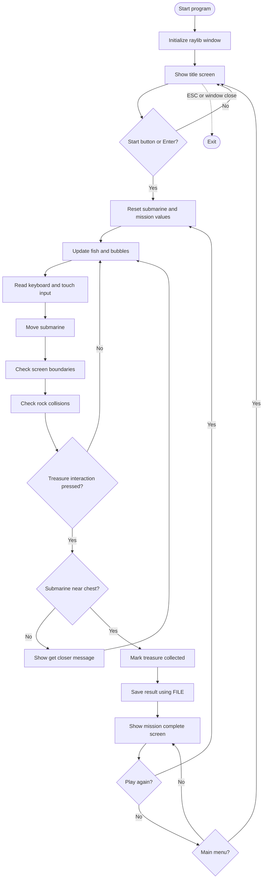

# Program Flowchart

```mermaid
flowchart TD
    A([Start program]) --> B[Initialize raylib window]
    B --> C[Show title screen]
    C --> D{Start button or Enter?}
    D -- No --> C
    D -- Yes --> E[Reset submarine and mission values]
    E --> F[Update fish and bubbles]
    F --> G[Read keyboard and touch input]
    G --> H[Move submarine]
    H --> I[Check screen boundaries]
    I --> J[Check rock collisions]
    J --> K{Treasure interaction pressed?}
    K -- No --> F
    K -- Yes --> L{Submarine near chest?}
    L -- No --> M[Show get closer message]
    M --> F
    L -- Yes --> N[Mark treasure collected]
    N --> O[Save result using FILE]
    O --> P[Show mission complete screen]
    P --> Q{Play again?}
    Q -- Yes --> E
    Q -- No --> R{Main menu?}
    R -- Yes --> C
    R -- No --> P
    C -. ESC or window close .-> S([Exit])
```

The main loop repeats the update and drawing steps while the game is open. The title, gameplay, and completion screens are separate game states.
